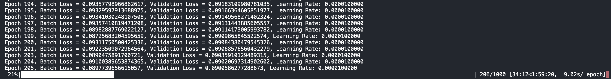

# Mo-net

## Overview

This project is a simple implementation of a deep learning library. The goal of
this project is to implement deep learning concepts and functions by hand using
jax/numpy without using popular libraries such as PyTorch or TensorFlow by
understanding the underlying maths and reading papers.


## Usage

```shell
uv sync
uv run train --quickstart mnist_mlp
```

## Features

- Implementations for some normalisation types.
- Implementation of an Adam optimiser.
- Data parallelism using multiple CPU cores for parallel training.
- Web server monitoring interface.
- Logging to a database.



## Motivation

PyTorch and TensorFlow exist. Why do this? I found that following recipes to
build neural networks using existing libraries did not teach me the concepts at
a level of understanding I sought. So I went another way. Using just an
understanding of the underlying mathematics, and reading the relevant papers, I
seek to understand the significance of different deep learning techniques by
iterating upon implementations of them. Rapidly, one learns what works, what is
important to be super precise in implementing, but also, surprisingly, just how
resilient neural networks can be to implementation errors. The process of
ensuring correctness of implementation can only be learnt by doing.
Debugging neural networks is very different from debugging procedural code.

## Performance

This library is not performant. Nor is it meant to be. Its primary reason for
existing is pedagogical. And as a result, many of the implementation details are
far simpler than is the case for proper, production-grade deep learning
libraries. Attempts have been made to improve performance where possible, and
this process has been very instructive in its own right.

# GPU/MPS Setup Guide for mo-net

This guide explains how to enable GPU acceleration (including Apple Metal/MPS).

## Supported Devices

- **CPU**: (Default)
- **CUDA GPU**: NVIDIA GPUs
- **Metal/MPS**: Apple Silicon Macs

## Installation

## Usage

### Command Line

Use the `--device` flag when training:

```bash
uv run train --dataset mnist --device auto

# Specify a device
uv run train --dataset mnist --device gpu    # NVIDIA GPU
uv run train --dataset mnist --device mps    # Apple Metal
uv run train --dataset mnist --device cpu    # CPU only
```

### Python API

```python
from mo_net.device import set_default_device, print_device_info

# Set device before creating models or training
set_default_device("auto")  # or "gpu", "mps", "cpu"

# Check available devices
print_device_info()
```

### Checking Device Availability

Run the included script to check your device setup:

```bash
uv run check_device
```

This will show:
- Available JAX devices
- Which device is currently selected
- A simple test computation

## Performance Tips

1. **Memory Management**: JAX pre-allocates GPU memory by default. To share GPU with other processes:
   ```python
   from mo_net.device import enable_gpu_memory_growth
   enable_gpu_memory_growth()
   ```

3. **Mixed Precision**: JAX uses float32 by default, which is optimal for most GPUs.

## Troubleshooting

### CUDA GPU Not Detected
- Ensure CUDA is installed: `nvidia-smi`
- Check JAX CUDA version matches your CUDA installation
- Reinstall JAX with correct CUDA version

### Metal/MPS Not Working
- Ensure you're on macOS 12.0 or later
- Check that jax-metal is installed: `uv pip show jax-metal`
- Some operations may fall back to CPU on Metal

### Performance Issues
- Check device is actually being used: Look for device info in training logs
- Ensure batch size is appropriate for your GPU memory
- Monitor GPU usage with `nvidia-smi` (NVIDIA) or Activity Monitor (macOS)
``` 