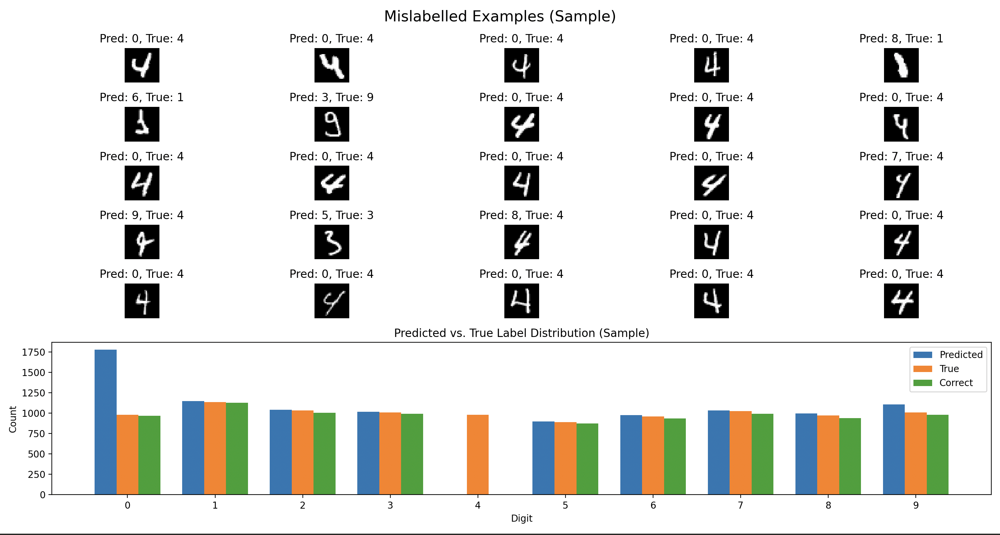
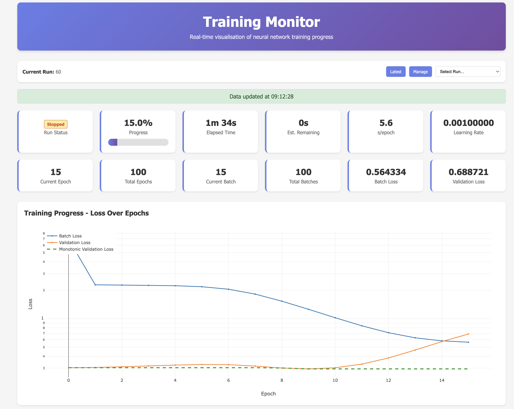
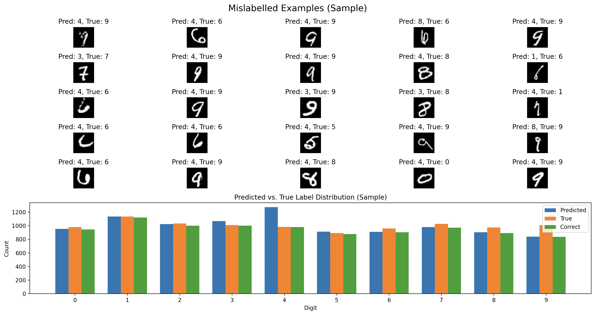

# Targeted Training

While training a CNN I noticed the model was not classifying fours.



So I ran

```
uv run train -m /Users/moye/Repos/mnist-numpy/data/output/1748279842_model_model.pkl -e 0 -s 1e-6,1e-6 --only-missclassified-examples
```

Which allowed us to target only the examples of four to teach the model to label them. This resulted in grokking.



The slight increase in validation loss initially shows that the model was unlearning the misclassified zeros and learning the representation for fours. This resulted in a sudden and sharp drop in both validation and batch loss once the representations for fours were learnt.



The model satisfactorily learnt the representations for fours and is now able to classify them.
